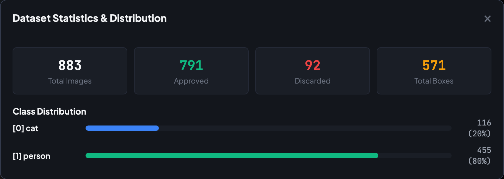

As I described in [part 1](/blog/backyard-ai-part-1) of this series, I've been collecting images of cats in my yard using a pre-trained YOLO model that I'll use to fine-tune a model specific to cats in my front yard. The images I'm collecting are already labeled, so for the most part, all the data I've collected is ready to use for training. However, despite the filtering I've added (see the last part for details), I'm still occasionally getting images that are mislabeled or which need to be adjusted.

I tried out a couple of different off-the-shelf products to help me out with this.

## YOLO Labeling VS Code Extension

The first thing I found was a VS Code extension called [YOLO Labeling](https://marketplace.visualstudio.com/items?itemName=AnDaoAi.yolo-labeling-vs). All I needed to do with this was point the extension to my data.yaml file, and it brings up an interface that lets me adjust, add, or remove the bounding boxes for anything I've detected.

The major downside of this extension is that it doesn't remember what I've already reviewed and what I haven't. I had to guess at the last image I reviewed and review from there, but I could never be sure.

## Label Studio

I decided to look for another tool that can keep track of what I've already reviewed so that I process the images as they come in. After some research, I decided to try out [Label Studio](https://labelstud.io/). Getting this set up was significantly more work than I'd hoped. It wasn't as easy as pointing it at my existing dataset. I had to write a script to generate the JSON file required to import the images. Then it was not capable of keeping watch on the folder for new images. The Label Studio server does have an API that I could have used to add new images to the queue automatically, but that would have required running the server continuously and modifying my data collection code.

## Vibe Coding The Solution

Since neither off-the-shelf product I tried really fit my use-case, I decided to try and make my own. This felt like the perfect opportunity to do some "vibe coding" to rapidly produce a solution. Since this is just something for myself, I don't have to worry as much about the code quality, and even if the first iteration doesn't work, I can make edits myself to at least get it working.

I wanted something lightweight that could run locally, read my existing YOLO `.txt` label files directly, and, most importantly, keep a simple state log of what I had already reviewed.

My prompt was something like this:

> "Build a local web app using FastAPI and vanilla JS. It needs to read images and YOLO-format label files from a local directory, display the image with bounding boxes on an HTML canvas, allow me to move or resize the boxes, and save the updated YOLO coordinates back to the text file. It also needs to maintain a json file to track progress."

### The Result

Within a few iterations to improve performance, I had a working tool that does exactly what I need. It tracks everything I've reviewed in `.simple-yolo-meta.json` folder, and allows me to adjust, add, and remove labels. There are simple keyboard shortcuts that let me move through the files quickly, and even statistics on how many images I've collected.

It's pretty mind-blowing how quickly we can build with AI now. We can build in minutes what would have taken us days.

If you're interested in checking out the code or trying it out for yourself, head to the GitHub repo: [github.com/haackr/simple-yolo](https://github.com/haackr/simple-yolo).

Next up in part 3, I'll walk through taking this clean, reviewed dataset and actually fine-tuning the model to run on the Raspberry Pi's Hailo AI accelerator. Stay tuned!
