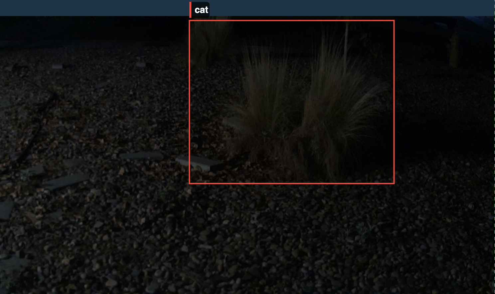

---
title: Edge AI in the Backyard - Part 1
description: Gathering training data to fine-tune a YOLO model to detect cats in my front yard.
pubDate: 2026-08-15
heroImage: detected-cat.png
heroImageAlt: A cat walking in a yard with a bounding box labeling the cat
---

Ever since I moved into my house in 2022, I've had a problem with the neighborhood cats treating my front yard as their personal litter box. Any time I try to plant in my flower beds or pull weeds, I'm greeted by the unpleasant sights and smells of half-buried cat poop. I've tried various commercial cat repellent sprays to absolutely no effect. 

So, I decided to over-engineer a more targeted (and fun) solution: an automated, AI-driven deterrent system. In this first post, I'll walk through the hardware architecture I designed and how I am currently collecting the training data needed to fine-tune my computer vision model.

## Concept Design

To make this work, the system architecture needs four main components:
- A controller to run the local inference
- A camera to capture the feed
- A computer vision model capable of detecting cats
- A physical deterrent mechanism

### The Controller

For the controller, I've gone with a [Raspberry Pi 5](https://www.raspberrypi.com/products/raspberry-pi-5/) and the [26 TOPS AI HAT+](https://www.raspberrypi.com/products/ai-hat/). I briefly considered the new Arduino Uno Q, which includes both a microcontroller and a microprocessor, but in the end, it was clear the combination of the Pi and the AI HAT would give me optimal performance and efficiency for handling the video stream and running the inference model.

### The Camera

Since I had decided to go with the Raspberry Pi, I initially thought my best option would likely be the [Camera Module 3](https://www.raspberrypi.com/products/camera-module-3/). However, since the neighborhood cats are often active at night, I wanted something with exceptional low-light performance. After researching many different options, I decided to go with the [Arducam B0647](https://www.amazon.com/dp/B0H69BKDNB). This camera module features a STARVIS IMX290 sensor with great low-light capabilities. It also has a mechanically switchable IR filter that I'm not currently using, but gives me the opportunity to explore even better nighttime performance in the future.

If I were making the decision again, I might look for something with a slightly wider field of view. The 102° FOV provided by this camera is fairly good, but after collecting data for a few weeks, it's become pretty clear that I would catch more cats with a wider angle lens.

### The Model

For the model, I've gone with Ultralytics' most recent YOLO model, [YOLO26m](https://docs.ultralytics.com/models/yolo26). This is trained on the COCO dataset, so it can already detect people and cats, and the tooling around this model made it simple to get a baseline inference script running right out of the box.

### The Deterrent

My original thought was to build a motorized water cannon that could rotate and tilt using servos to actively aim at the cats. I eventually decided that adding moving parts was a bit more complicated than necessary, at least for the first implementation.

Now, my plan is fairly simple: I'll trigger a stationary lawn sprinkler any time a cat is detected. To accomplish this, the Pi will send a signal via its GPIO pins to trigger a relay, which will then actuate a standard solenoid valve hooked up to my garden hose.

## Collecting Training Data

 While the YOLO26m model can already detect cats and people fairly accurately, to ensure consistent performance in my yard without false positives, I'll be fine-tuning the model using data specific to my yard. In order to do this, I'll need to build a dataset of labeled images of cats and people that I can use for the training.

To collect the training data, I've written a fairly simple python script which runs inference on the camera feed and saves images and their labels in the standard YOLO format. To reduce the compute required, I'm only running inference at 4 fps and to prevent collecting to many similar images, there is a 3-second cooldown before saving a new image.

### Challenges

I've run into a few challenges so far in collecting the data. First, it was very apparent early on that the YOLO26 model is much better at detecting people than cats. This meant that, while I needed to use a low confidence level to ensure I was capturing all cats, that same confidence was resulting in way too many false positives in labeling people.

To get around this, I ended up setting the confidence for the model to 15% while only saving the images / labels for people if the confidence was above 50%.

```py
# Save if it's a cat (15) 
# OR if it's a person (0) with >50% confidence
if cls_id == 15 or (cls_id == 0 and conf > 0.5):
  sufficient_detection = True
```

The next challenge I ran in to was false positives at night where the model thought that two bushes in my front yard were a cat.



My first approach to fix this was to only save images of the detected object if it was moving sufficiently. To do this, I store the center point of the detection, and then look to see if it has moved more than a threshold before saving it again.

```py
# Check to see if there there is any movement
# from the detected object.
for last_x, last_y in saved_centers:
    distance = math.hypot(x_c - last_x, y_c - last_y)
    if distance < STATIC_TOLERANCE:
        is_static = True
        break
if not is_static:
    significant_movement = True
```

While that did prevent me from saving too many images of my bushes, there was still occasionally enough jitter in the detection cause more false positives. After implementing this, I realized there was a much simpler way I could avoid these false positives. The bounding box around the bushes is much larger than any cat is going to be in the frame. This means I can throw away any detection of a cat larger than some threshold.

```py
def filter_big_cats(boxes) -> list:
    valid_boxes = []
    for box in boxes:
        w = float(box.xywhn[0][2])
        h = float(box.xywhn[0][3])
        size = w * h
        if int(box.cls[0]) == 15 and size > MAX_CAT_SIZE:
            continue
        valid_boxes.append(box)
    return valid_boxes
```

After implementing all of this filtering, I'm now generating a steady supply of clean data for my dataset.

You can check out the full source code at [github.com/haackr/collect-cat-images](https://github.com/haackr/collect-cat-images)

## What's Next?

While I'm currently collecting a stead stream of training data, I'm only getting between 5 and 10 images a day. At that rate it'll take me quite a while to collect all the training data I need to fine tune the model. I'm exploring various methods of data synthesis including generative models and procedural 3d rendering to supplement my real world data.

Since I'm using a pre-trained model, most of the labeling work will already be done for me. I just need to go through what I've collected and remove the labels for any false positives and adjust bounding boxes as needed for any wonky detections. Those unlabeled false-positives will be perfect negative cases for the training set, helping my fine-tuned model avoid them

Once I've gathered enough data, I'll annotate the data as needed, fine-tune the model, compile it for use on the AI HAT, and build out the deterrence system.

*Stay tuned for Part 2, where I'll cover the next step in my backyard edge AI journey.*
