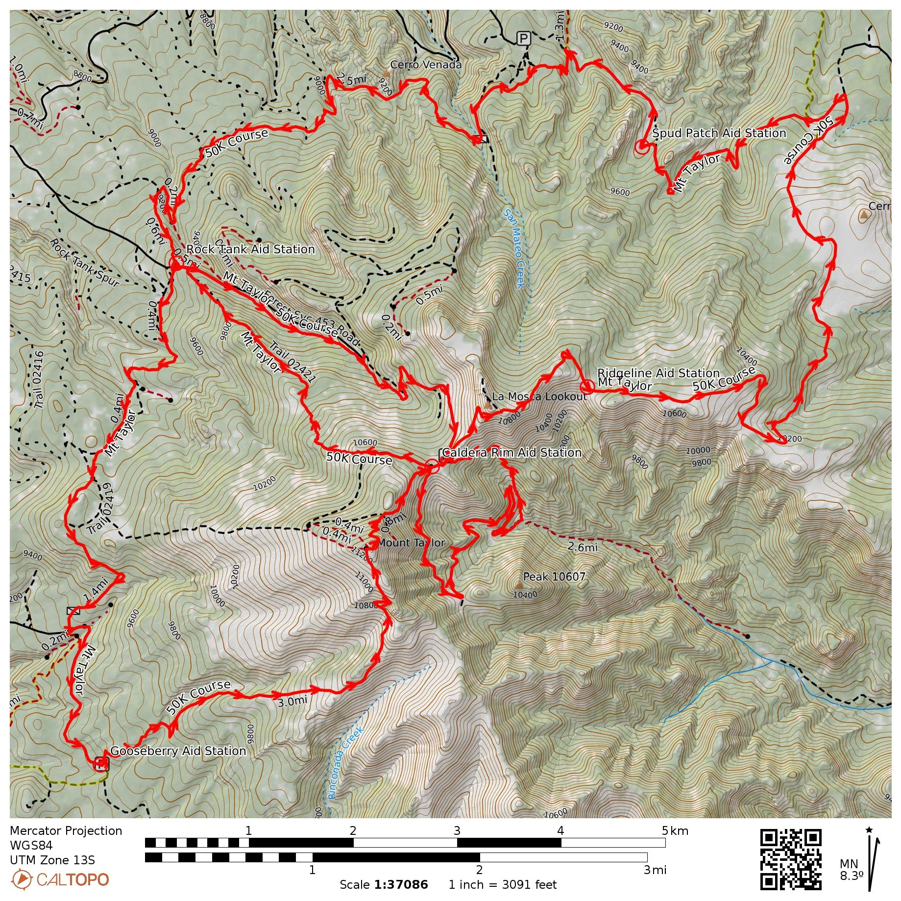
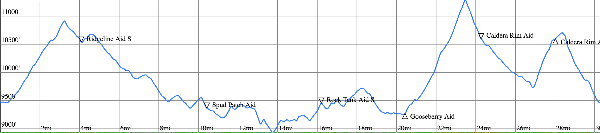
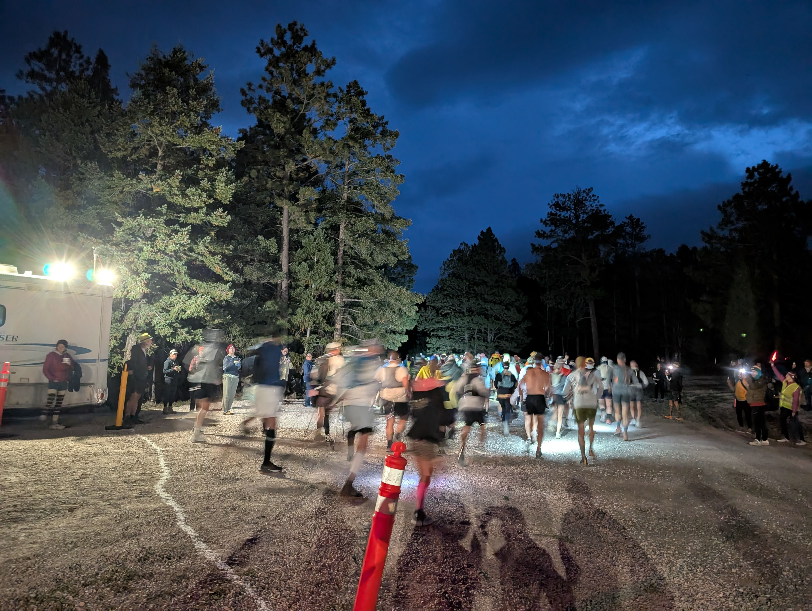
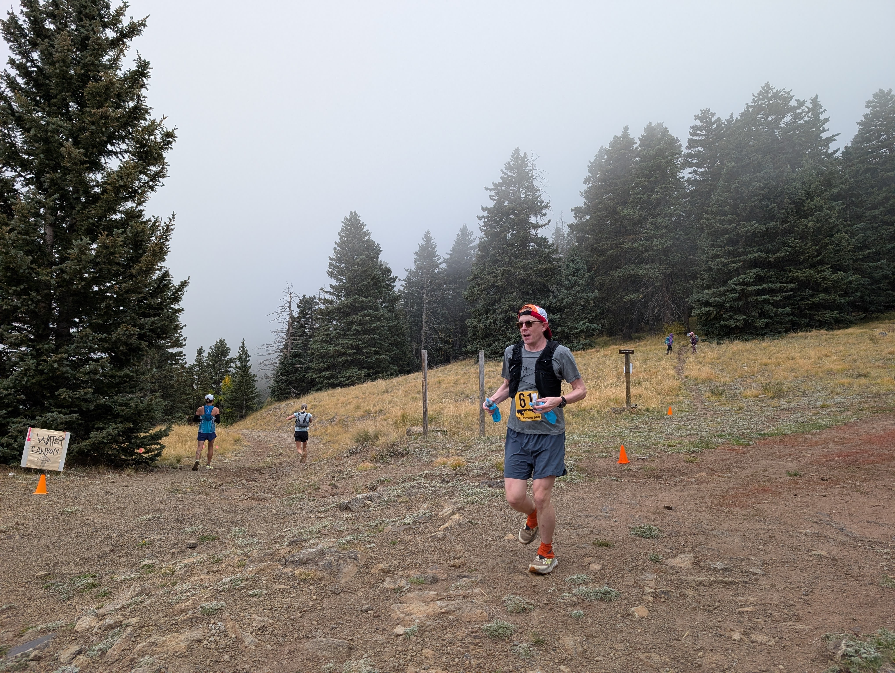
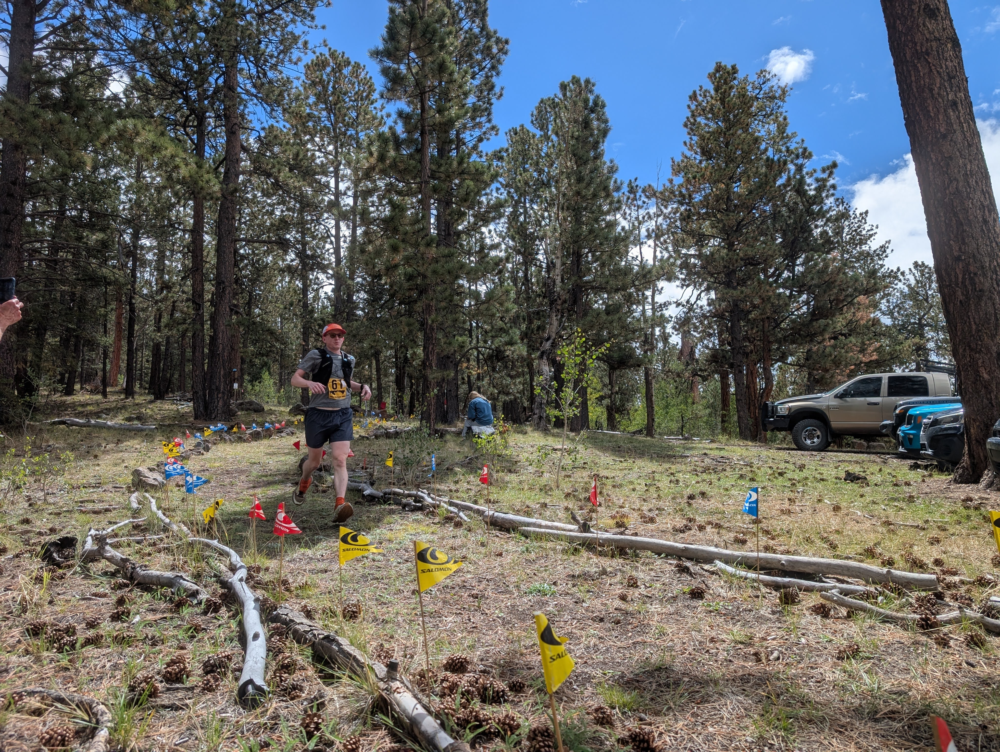

import { Image } from 'astro:assets';
import rockTank from './rock-tank.jpg';

At 6:30 AM on September 27th I and 128 other runners started the Mt. Taylor 50k. The course is a 30-mile two loop tour of Mt. Taylor with 7,000ft of elevation gain. It reaches a max elevation of 11,301 and is entirely above 9,000ft. This race is a New Mexico classic and one of my bucket-list races. With its mountain terrain and significant elevation gain, it was a challenging choice for my first 50k, but I'm glad I took the risk because it was a grueling but beautiful and rewarding experience.

I trained for a little more than 6-months for this race. Prior to beginning my training cycle, I was running around 25 to 30 miles a week. During my training I worked up to a peak 55-mile week and peak elevation gain of over 10,000ft. I also put a lot of effort into making sure that I was consistently getting enough sleep, feeding myself well, and cutting back on my alcohol consumption greatly during my training.

I drove up to Grants the night before and picked up my race packet and headed to my hotel room. My sister and parents drove up shortly after to come watch me the next day, so I got to spend time with them which I greatly appreciated as it was better than sitting in my hotel room alone feeling anxious about the next day. I got to bed early knowing I had an early morning ahead of me.

I woke up around 4:30 giving me enough time to cook myself breakfast – eggs and a bagel – and then get myself packed up and ready to drive up to the start. The drive was packed with other racers heading to the start as well, but the volunteers made it easy to navigate and get parked.

After arriving, I checked in my drop-bag and chatted with my family and some of the other folks there waiting to get started.

The start is early enough that we all begin with headlamps. We were told we could drop our headlamps at the first aid-station, but I forgot and ended up carrying mine all the way until I picked up my drop-bag back at the start.

I felt very strong in the first half. After a short descent from the start, you begin climbing almost right away for the first 3-miles and then descend back down to the Ridgeline aid station. Here I chatted briefly with Ken Gordon, one of the founders of the Mt. Taylor 50k and parent of one of my high school cross-country teammates from back in the day.

After a short climb from the ridgeline aid station, you start a big descent down to the Spud Patch aid station. I knew from previewing the course that this section is deceptively easy. It doesn't feel like you're putting a ton of effort in for this stretch, but the sustained downhill really puts wear and tear in your quads that you are definitely going to feel later.

From there, it's a rolling jaunt back to the start at mile 16. Sometime between spud patch and the start, I started to feel like I needed to poop. I thought about ducking into the woods to dig a hole a few times, but thankfully didn't end up needing to. A small group of about 5 of us formed during this section and ran for a few miles together before I broke off of the front closer to the start.

Back at the rock tank aid station where we started, the volunteers helped me resupply from my drop-bag. There was a bit of a malfunction with my soft flask that resulted in me emptying it all over myself as I was trying to put it back in my vest. Thankfully it was just the one filled with water not the one filled with tailwind. Unfortunately, after re-supplying I lost a few minutes here availing myself of the porta-potties, but that was better than having to duck into the woods.
<Image
  src={rockTank}
  alt="Rock Tank"
  class="max-w-md mx-auto"
/>

From rock tank, it's more rolling terrain over to the gooseberry aid station where the climb up to the peak starts just over 20 miles in. I had plenty of food and water on-board here, so I didn't stop at this one which helped me put a big gap on someone I had been running near for quite a while.

On the climb up to the peak is where the race really starts. Until this point I've felt very strong, but some time up this climb I really start to suffer. The climb up to the peak is long and steep, and I suspect I didn't really take in as many calories on the climb as I should have. Getting to the top was a massive relief, but that relief was short-lived.

The climb down from the peak was maybe the most painful experience I've ever had running. My quads and knees were in so much pain, that running was a complete no-go. All I could do was hobble down the steep descent and dread what was to come. After reaching the peak of Mt. Taylor, you descend more than 1,000ft down into the caldera, before a 1,000 climb back out.

Thankfully, it wasn't long before I got to the caldera rim aid station just over 24 miles in where I was pleasantly surprised to see my family who had hiked up from the start to cheer me on and see the sights.

The energy boost I got from seeing my family and eating possibly the best tasting pickles on the planet (though that was probably just the exhaustion speaking) brought me back to life. After a bit more hobbling, I was finally able to work the soreness out of my legs somewhat and start running again. My time spent climbing down into the caldera and back out was surprisingly pleasant considering how much I was suffering.

Once I finished the climb back out, I ran back through the caldera aid station without stopping. From here it's a 2-mile steep descent to the finish. When I previewed the course, I thought this would be an easy cruise, but the steep terrain combined with the fatigue in my legs meant it was one of the hardest parts of the race. It was back to the kind of pain I was feeling coming off of the peak, so I was barely able to run for long sections. When I train for this race in the future, I will definitely dedicate more miles to practicing steep descents and gaining quad strength.

When the terrain started to get less steep and I saw the first spectator on the side of the trail I knew I was finally getting close. I started to cry when the relief of nearly being done and the pride in accomplishing this feat washed over me. Thankfully, I was able to calm down a little bit before I actually got into the finish area.

I was the 23rd person (13th man) to cross the line with a time of 6:30:25. I met my family at the finish and treated myself to a well-earned beer and some BBQ provided by the volunteers. Overall, this is one of the best experiences of my life, and I'm looking forward to training for my next ultra.
